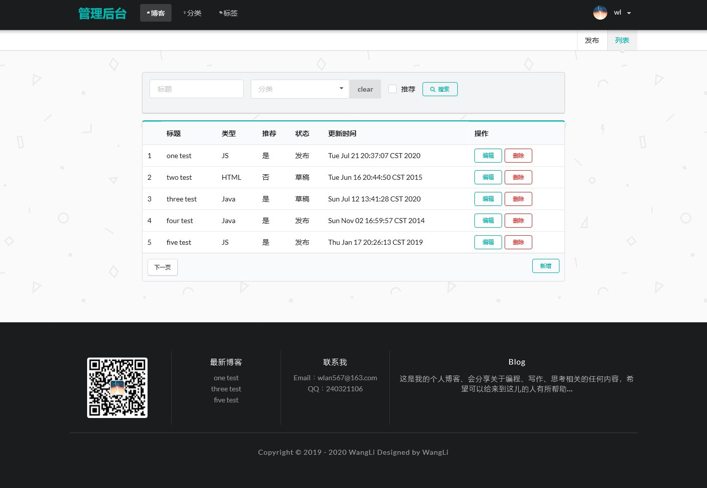
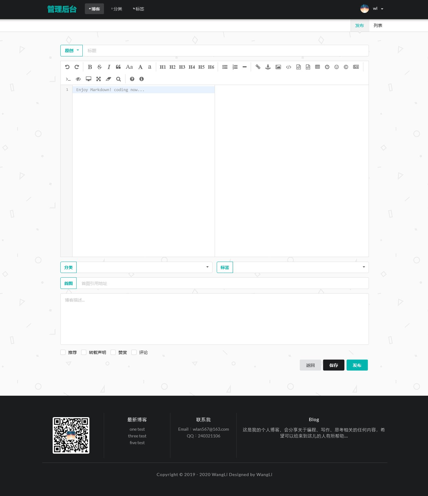
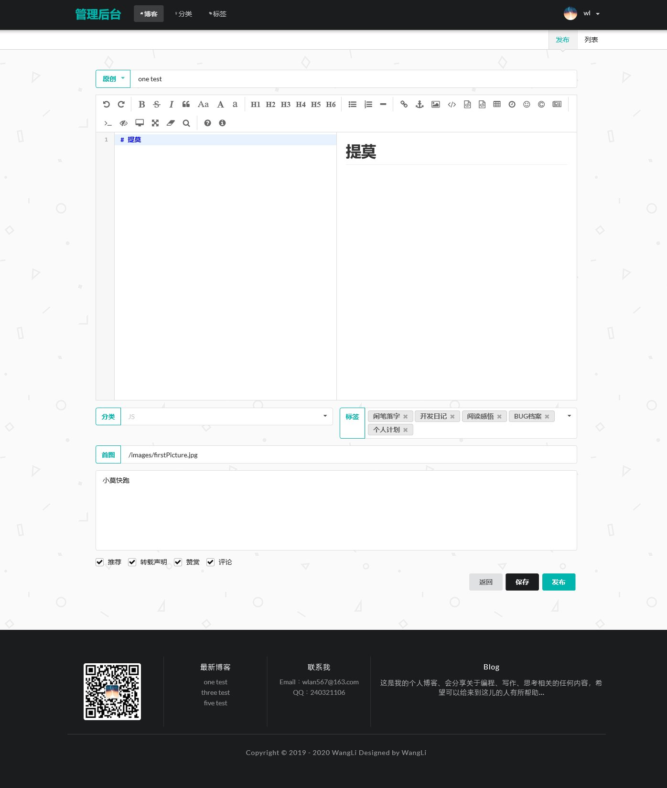
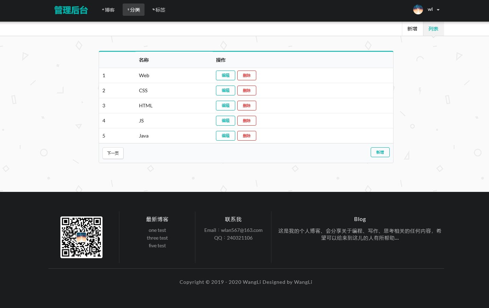
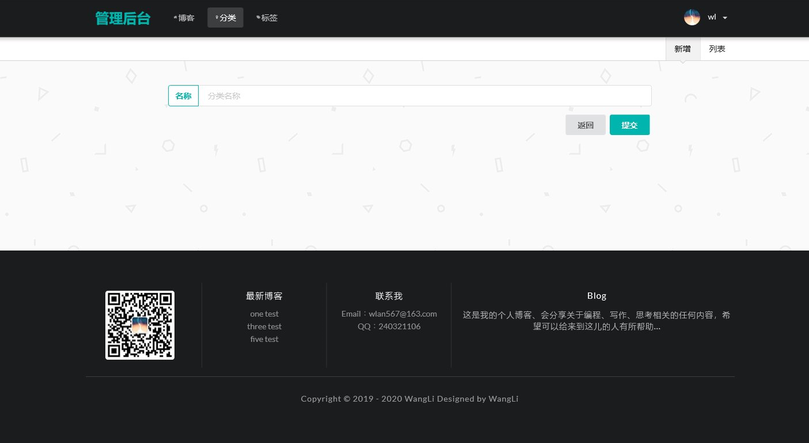
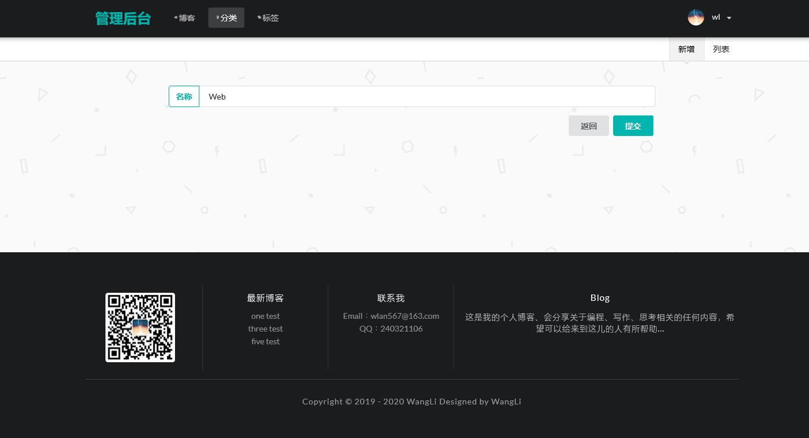
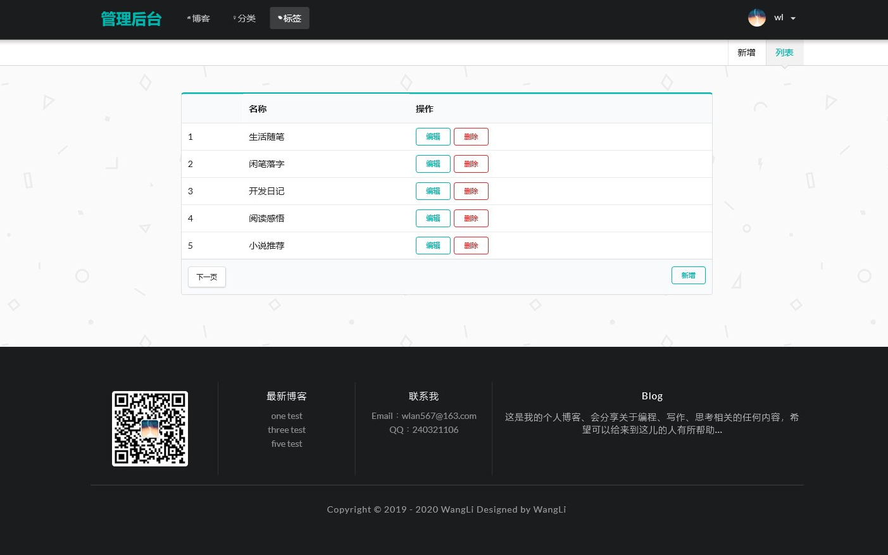
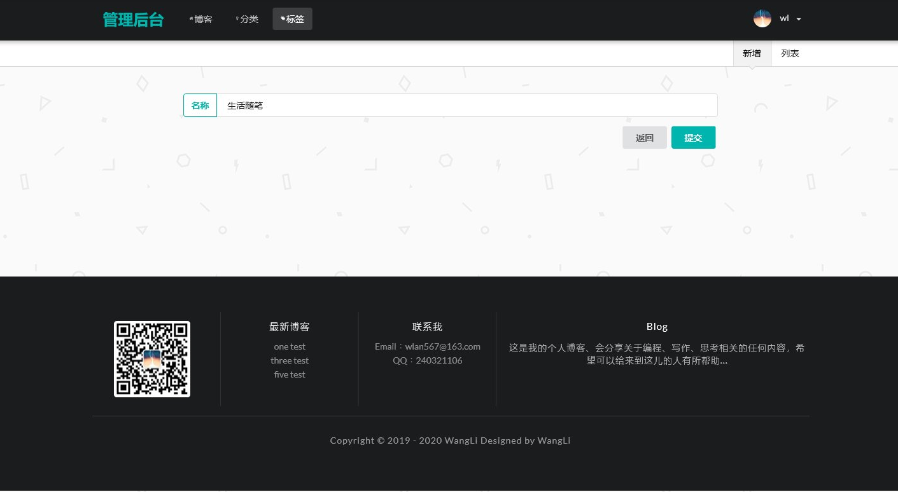

# SpringBoot个人博客

技术栈：springboot mybatis thymeleaf mysql

## 首页展示

## 博客详情

## 分类展示

## 标签展示

## 归档展示

## 关于我

## 博客管理

## 博客新增

## 博客编辑

## 分类管理

## 分类新增

## 分类编辑

## 标签管理

## 标签新增

## 标签编辑

